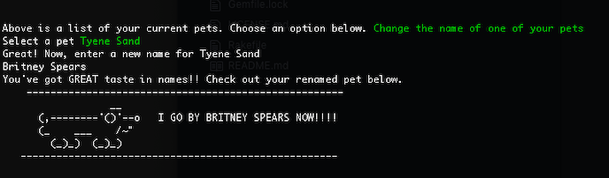
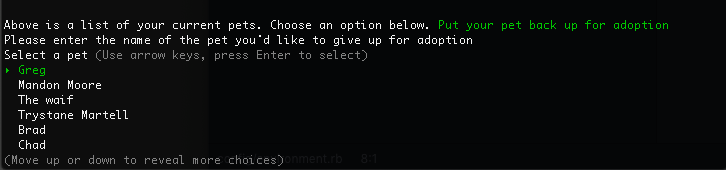
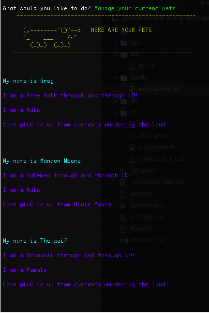

**Game of Thrones Adoption Agency**
========================
===========================================================

This game allows the user to search through and collect their favorite Game of Thrones characters (represented as 'pets' in this game!). GAA allows users to log in and view their current GOT pets at any time, change their pets' names and delete and/or add pets to their collection.

### **HOW TO INSTALL**

1. Visit this git repository via this link
2. Clone and download the game by copying the provided link on
   git and running 'git clone [PASTE LINK HERE]' in your terminal
3. Run 'bundle install' to download necessary gems

### **HOW TO RUN**

1. Run 'rake db:seed' (this seeds all the GOT data for the app!)
2. Run 'ruby bin/run.rb' to play!

### **FEATURES**

- _Stores user data!_ User can access their pets anytime with their login
- User is able to easily toggle through action menus to select their preferred
  actions
- User can search for pets to adopt by name and breed and are given to option
  to add (or not!) the selected pet to their collection
- User can manage their pets by updating the names of their pets and
  deleting selected pets from their collection
- User is provided with alternate wildcard options that provides user with
  randomly selected pets to potentially adopt

### **SEE IT IN ACTION**
Visit the youtube link here!
[Game of Thromes Adoption Agency Walk-Through](https://www.youtube.com/watch?v=DeAKruSZiBU&feature=youtu.be)

#### Breed Selection

#### Updating a Pet's Name

#### Deleting a Pet

### Viewing Your Pets

### **CREDITS**
Creators: [Caleb Watters](https://github.com/calebwatters) and [Hanna Engel](https://github.com/hannaengel)

Gems Used: https://rubygems.org
- gem "sinatra-activerecord"
- gem "sqlite3"
- gem "pry"
- gem "require_all"
- gem "faker"
- gem 'rest-client'
- gem 'json'
- gem 'tty-prompt'
- gem 'colorize'
